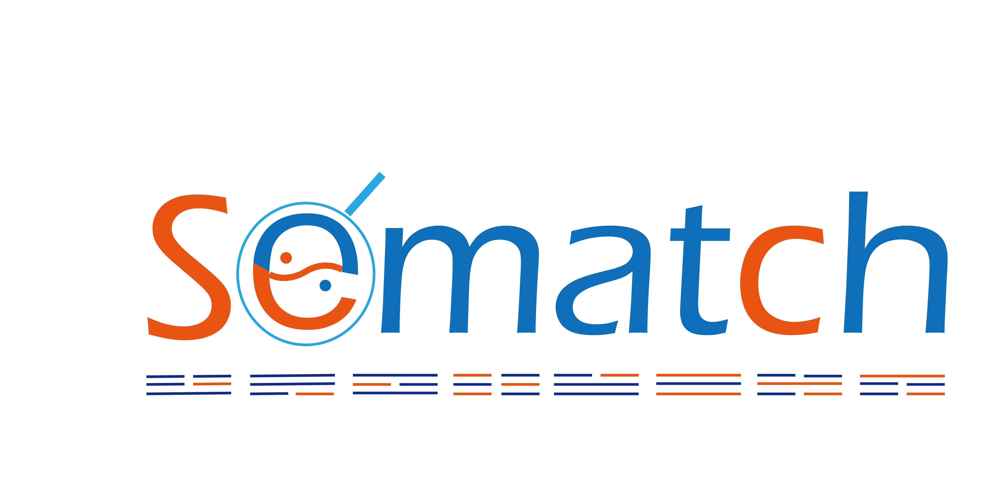
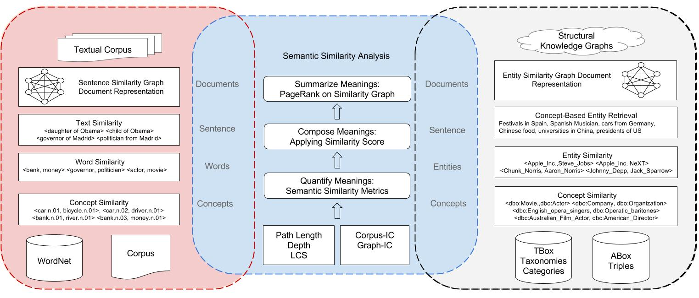

------------------

# Sematch: Semantic Similarity Analysis


## You have just found Sematch

Sematch is a semantic similarity analysis library, written in Python. Semantic similarity is a very useful metric for many applications that require to quantify the semantic distance between concepts using structural knowledge drawn from conceptual taxonomy and statistical information calculated from textual corpora. Sematch was developed with a focus on enabling semantic similarity analysis in both textual corpora and structural Knowledge Graphs (KGs).



This motivation comes from the observation that many textual applications and KG applications share a common pipeline in using semantic similarity analysis. In textual applications, word similarity is measured based on WordNet taxonomy or word cooccurence. Then text similarity (sentence level) is measured by composing word similarities, while document level text could be analysed by identifying important sentences based on text similarity, e.g. TextRank.  Obviously, the pipeline starts from measuring concept similarity. Concepts usually represent atomic word meanings  and have a hierarchical structure, such as WordNet synsets. Concept similarity are normally quantified using various information such as structural knowledge (e.g. path length, depth, least common subsumer) and statistical knowledge ( information content).

KG based application also have similar pipeline. Entities in KGs are similar to words, while entities are described by concepts  (e.g. dbo:Movie, dbc:English_opera_singers) which are similar to word meanings (senses). Similar to word similarity, entity similarity can be quantified based on concept similarity. Moreover, those concepts in KGs are usually constructed into hierarchical taxonomies, such as DBpedia ontology class, Wikipedia categories, therefore quantifying concept similarity in WordNet or DBpedia relies on similar semantic information (e.g. path length,  depth, least common subsumer, information content) and semantic similarity metrics (e.g. Path, Wu & Palmer,Li,  Resnik, Lin, Jiang & Conrad and WPath). Furthermore, as WordNet concepts have been integrated into many modern KGs such as DBpedia, YAGO and BabelNet, it would be convenient to apply conventional textual similarity analysis to KGs. Consequently,  Sematch aims to provide a framework to develop and evaluate semantic similarity metrics for concepts, entities, texts and their applications.


------------------


## Guiding principles

The goal of the sematch is to provide several core tools for semantic similarity analysis. Aiming this goal, Sematch has several guiding principles in development.

- Provide a convenient framework for developing and evaluating semantic similarity metrics and provide easy interface in developing similarity based applications.
- Connect the textual world with KGs by providing linking and disambiguations. This could be viewed as application of semantic similarity metrics. Also, linking and disambiguation could be useful for higher level applications.


------------------


## Getting started: 20 minutes to Sematch

The core module of Sematch is measuring semantic similarity between concepts that are represeted as concept taxonomies. Word similarity is computed based on the maximum semantic similarity of WordNet concepts. Sematch uses WordNet interface from NLTK so it covers several common similarity metrics such as  Path, Wu & Palmer, Resnik, Lin, Jiang & Conrad. Sematch also provides some similarity metrics that are not covered in NLTK, such as Li method and WPath metric.  Some common interfaces for semantic information are provided so that novel similarity metrics are easy to implement with Sematch.  Moreover,  [Open Multilingual WordNet](http://compling.hss.ntu.edu.sg/omw/) is integrated so that both mono-lingual and cross-lingual word similarity are available.

```python
from sematch.semantic.similarity import WordNetSimilarity
wns = WordNetSimilarity()
dog = wns.word2synset('dog')#e.g. Synset('dog.n.01')
cat = wns.word2synset('cat')#e.g. Synset('cat.n.01')
# Measuring semantic similarity between concepts using Path method
print wns.similarity(dog[0], cat[0], 'path')  # 0.2
# Computing English word similarity using Li method
print wns.word_similarity('dog', 'cat', 'li') # 0.449327301063
# Computing Spanish word similarity using Lin method
print wns.monol_word_similarity('perro', 'gato', 'spa', 'lin') #0.876800984373
# Computing Chinese word similarity using  Wu & Palmer method
print wns.monol_word_similarity('狗', '猫', 'cmn', 'wup') # 0.857142857143
# Computing Spanish and English word similarity using Resnik method
print wns.crossl_word_similarity('perro', 'cat', 'spa', 'eng', 'res') #7.91166650904
# Computing Spanish and Chinese word similarity using Jiang & Conrad method
print wns.crossl_word_similarity('perro', '猫', 'spa', 'cmn', 'jcn') #0.31023804699
# Computing Chinese and English word similarity using WPath method
print wns.crossl_word_similarity('狗', 'cat', 'cmn', 'eng', 'wpath')#0.593666388463
```

In order to apply similarity metrics to KGs, Sematch contains WordNet and YAGO mappings derived from [YAGO dataset](http://www.mpi-inf.mpg.de/departments/databases-and-information-systems/research/yago-naga/yago/downloads/). Consequently, YAGO type URIs can be treated similarly as WordNet synsets. By having graph-based IC, semantic similarity between YAGO types and corresponding synsets used in YAGO can been measured based on the type distribution in DBpedia.

```python
from sematch.semantic.similarity import YagoTypeSimilarity
yago_sim = YagoTypeSimilarity()
#Mapping a word to yago links in DBpedia
dancer = yago_sim.word2yago('dancer')#'http://dbpedia.org/class/yago/Dancer109989502'
actor = yago_sim.word2yago('actor') #'http://dbpedia.org/class/yago/Actor109765278'
singer = yago_sim.word2yago('singer')#'http://dbpedia.org/class/yago/Singer110599806'
#Mapping a yago link to word net synset
yago_sim.yago2synset(actor[0]) # Synset('actor.n.01')
#Measuring semantic similarity between yago links through WordNet taxonomy
yago_sim.yago_similarity(dancer[0], actor[0], 'wpath')#0.642
yago_sim.yago_similarity(singer[0], actor[0], 'wpath')#0.544
#Measuring word similarity based on graph-based IC using yago concepts
#using corpus-based IC from brown corpus
yago_sim.word_similarity('dancer', 'actor', 'wpath')#0.642
#using graph-based IC from DBpedia
yago_sim.word_similarity('dancer', 'actor', 'wpath_graph')#0.423
```


When developing new similarity metrics, proper evaluation is important, whereas sometimes it is tedious. Sematch helps save such efforts by providing a evaluation framework, where similarity metrics are evaluated with common Word Similarity datasets. Futhermore, a statistical test is included by comparing two similarity metrics.

```python
from sematch.evaluation import WordSimEvaluation
from sematch.semantic.similarity import WordNetSimilarity
wordsim_eval = WordSimEvaluation()
wns = WordNetSimilarity()
#define similarity metrics
lin = lambda x, y: wns.word_similarity(x, y, 'lin')
wpath = lambda x, y: wns.word_similarity_wpath(x, y, 0.8)
#evaluate similarity metrics
wordsim_eval.evaluate_multiple_metrics({'lin':lin, 'wpath':wpath}, 'noun_simlex')
#performa Steiger's Z significance Test
wordsim_eval.statistical_test('wpath', 'lin', 'noun_simlex')
```

Although the word similarity correlation measure is the standard way to evaluate the semantic similarity metrics, it relies on human judgements over word pairs which may not have same performance in real applications. Therefore, apart from word similarity evaluation, the Sematch evaluation framework also includes a simple aspect category classification for Aspect Based Sentiment Analysis.

```python
from sematch.classification import SimCatClassifier
from sematch.evaluation import ABSAEvaluation
#defining similarity metric
wns = WordNetSimilarity()
sim_metric_jcn = lambda x, y: wns.word_similarity(x, y, 'jcn')
sim_metric_wpath = lambda x, y: wns.word_similarity_wpath(x, y, 0.9)
#loadding dataset
absa_eval = ABSAEvaluation()
X_train_16, y_train_16 = absa_eval.load_dataset('path to ABSA16_Train')
X_test_16, y_test_16 = absa_eval.load_dataset('path to ABSA16_Test')
#train the classifiers
sim_jcn_classifier = SimCatClassifier.train(zip(X_train_16, y_train_16), sim_metric_jcn)
sim_jcn_classifier = SimCatClassifier.train(zip(X_train_16, y_train_16), sim_metric_wpath)
#evaluate the classifiers
absa_eval.evaluate(X_test_16, y_test_16, sim_jcn_classifier)
absa_eval.evaluate(X_test_16, y_test_16, sim_wpath_classifier)
```

Like the words can be mapped to WordNet concepts, some muti-word expressions can be mapped to real word entities based on their meanings. Usually, such expressions are composed by a meaningful noun and a specific proper noun, which we can call as type of things. For example, university (common noun) and Madrid (proper noun) refer to all the universities located in Madrid. To conveniently map such experessions to their corresponding entities in DBpedia, you can use sematch EntitySearch class.

```python
from sematch.search import EntitySearch
searcher = EntitySearch()
print searcher.search('university in Madrid')
print searcher.search('movies with Tom Cruise')
```

The common nouns are linked to YAGO concepts through YAGO mappings, while the proper nouns are linked to DBpedia through our SPARQL module and Linking module. In Linking module, we have implemented several wrappers for Entity Linking tools such as DBpedia Spotlight, TagMe, and BabelNet. The SPARQL module has several classes that can be used to implement useful functionalities for interacting with KGs.

```python
from sematch.sparql import NameSPARQL
#a simple linker to match proper noun through labels and names.
name_linker = NameSPARQL()
name_linker.name2entities('China')#'http://dbpedia.org/resource/China'
name_linker.name2entities('Spain')#'http://dbpedia.org/resource/Spain'
from sematch.sparql import EntityFeatures
#extract entity information from DBpedia
entity_f = EntityFeatures()
yin_and_yang = entity_f.features('http://dbpedia.org/resource/Yin_and_yang')
```

------------------

## Installation

Sematch uses the following dependencies:

- numpy, scipy, scikit-learn are used for scientific computing and machine learning.
- networkx is used for taxonomy, similarity graph construction and application.
- nltk is used for natural language processing tasks.
- gensim is used for semantic analysis.
- RDFLib, SPARQLWrapper, requests are used for interacting with Knowledge Graphs.
- Flask is used to implement web services.
- pytest is used for unit testing

You should check out the requirements.txt to install the complete dependencies.

To install Sematch, you need to install its dependencies and download some datasets it requires. In NLTK, you need to download WordNet 3.0 and Open Mutilingual WordNet. We have included experimental datasets and type mappings with YAGO in models folder inside Sematch. However, some datasets such as Aspect Based Sentitiment Analysis you need to download from their original site.

Currently, you could clone Sematch and setup it in your local.

```shell
git clone http://github.com/gsi-upm/sematch
#after setting up dependencies and downloading datasets, you could test it
cd tests
pytest
```

------------------

## Publications

- Ganggao Zhu and Carlos A. Iglesias [Computing Semantic Similarity of Concepts in Knowledge Graphs](http://ieeexplore.ieee.org/document/7572993/), TKDE, 2016.
- Oscar Araque, Ganggao Zhu, Manuel Garcia-Amado and Carlos A. Iglesias [Mining the Opinionated Web: Classification and Detection of Aspect Contexts for Aspect Based Sentiment Analysis](http://sentic.net/sentire2016araque.pdf),  ICDM sentire, 2016.
- Ganggao Zhu and Carlos A. Iglesias [Sematch: Semantic Entity Search from Knowledge Graph](http://km.aifb.kit.edu/ws/sumpre2015/paper4.pdf)
  ESWC SumPre 2015


------------------

## Support

You can post bug reports and feature requests in [Github issues](https://github.com/gsi-upm/sematch/issues).
Make sure to read our guidelines first.
This project is still under active development approaching to its goals. The project is mainly maintained by Ganggao Zhu. You can contact him via gzhu [at] dit.upm.es

------------------

## Why this name, Sematch and Logo?

The name of Sematch is composed based on Spanish "se" and English "match". It is also the abbreviation of semantic matching because semantic similarity metrics helps to determine semantic distance of concepts, words, entities, instead of exact matching.

The logo of Sematch is based on Chinese [Yin and Yang](http://en.wikipedia.org/wiki/Yin_and_yang) which is written in [I Ching](http://en.wikipedia.org/wiki/I_Ching). Somehow, it correlates to 0 and 1 in computer science.


